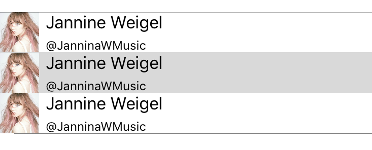

#### สร้าง Solution

- New -> Solution -> Multiplatform -> Xamarin.Forms -> Forms App (C#) -> `Intro`

####  เขียน `ContentPage`

- `New -> File -> Empty class -> StackLayoutExample.cs`

```csharp
public class StackLayoutExample : ContentPage {
    public StackLayoutExample () {
        Padding = new Thickness (20);
        var red = new Label {
            Text = "Stop", BackgroundColor = Color.Red, FontSize = 20
        };

        var yellow = new Label {
            Text = "Slow down", BackgroundColor = Color.Yellow, FontSize = 20
        };

        var green = new Label {
            Text = "Go", BackgroundColor = Color.Green, FontSize = 20
        };

        Content = new StackLayout {
            Spacing = 10,
            Children = { red, yellow, green }
        };
    }
}
```

- ไฟล์ `Intro.cs`

```csharp
public class App : Application {
    public App () {
        MainPage = new NavigationPage (new StackLayoutExample());
    }
}
```

#### สามารถปรับ Layout ใน `StackLayout` ดังนี้

```csharp
Content = new StackLayout {
    Spacing = 10,
    VerticalOptions = LayoutOptions.End,
    HorizontalOptions = LayoutOptions.Center,
    Orientation = StackOrientation.Horizontal,
    Children = { red, yellow, green }
};
```

#### สร้าง `ListView`

- `New -> File -> Empty class -> ListViewExample.cs`

```csharp
public class ListViewExample: ContentPage {
    public ListViewExample () {
        var listView = new ListView ();
        listView.ItemsSource = new string [] {
            "Buy pears", "Buy oranges", "Buy mangos", "Buy apples", "Buy bananas"
        };

        Content = new StackLayout {
            Children = { listView }
        };
    }
}
```

#### สร้าง `CustomListView`

- `New -> File -> Empty class -> CustomListViewExample.cs`

```csharp
public class CustomListViewExample: ContentPage {
    public CustomListViewExample () {
        var listView = new ListView ();
        listView.ItemsSource = new TodoItem [] {
            new TodoItem { Name = "Buy pears" },
            new TodoItem { Name = "Buy oranges", Done=true} ,
            new TodoItem { Name = "Buy mangos" },
            new TodoItem { Name = "Buy apples", Done=true },
            new TodoItem { Name = "Buy bananas", Done=true }
        };
        listView.ItemTemplate = new DataTemplate (typeof (TextCell));
        listView.ItemTemplate.SetBinding (TextCell.TextProperty, "Name");
        listView.ItemSelected += async (s, e) => {
            var todoItem = (TodoItem)e.SelectedItem;
            await DisplayAlert ("Tapped!", todoItem.Name + " was tapped.", "OK");
        };

        Content = new StackLayout {
            Children = { listView }
        };
    }
}

class TodoItem {
    public string Name { set; get; }
    public bool Done { set; get; }
}
```

#### สร้าง `CustomListViewCell`

- `New -> File -> Empty class -> CustomListViewCell.cs`

```csharp
public class CustomListViewCell : ContentPage {
    public CustomListViewCell()
    {
        var customers = GetCustomers ();
        var listView = new ListView {
            RowHeight = 40,
            ItemsSource = customers,
            ItemTemplate = new DataTemplate (typeof (CustomerCell))
        };

        Content = listView;
    }

    private List<Customer> GetCustomers()
    {
        return new List<Customer> {
            new Customer {
                DisplayName = "Jannine Weigel",
                ImageUri = "https://pbs.twimg.com/profile_images/716123364813721600/igCb7gS1_400x400.jpg",
                Twitter = "@JanninaWMusic"
            },
            new Customer {
                DisplayName = "Jannine Weigel",
                ImageUri = "https://pbs.twimg.com/profile_images/716123364813721600/igCb7gS1_400x400.jpg",
                Twitter = "@JanninaWMusic"
            },
            new Customer {
                DisplayName = "Jannine Weigel",
                ImageUri = "https://pbs.twimg.com/profile_images/716123364813721600/igCb7gS1_400x400.jpg",
                Twitter = "@JanninaWMusic"
            }
        };
    }
}

public class CustomerCell : ViewCell  {
    public CustomerCell() {
        var image = new Image {
            HorizontalOptions = LayoutOptions.Start
        };

        image.SetBinding (Image.SourceProperty, new Binding ("ImageUri"));
        image.WidthRequest = image.HeightRequest = 40;

        var nameLayout = CreateNameLayout ();
        var viewLayout = new StackLayout () {
            Orientation = StackOrientation.Horizontal,
            Children = { image, nameLayout }
        };

        View = viewLayout;
    }

    static StackLayout CreateNameLayout () {
        var nameLabel = new Label {
            HorizontalOptions = LayoutOptions.StartAndExpand
        };
        nameLabel.SetBinding (Label.TextProperty, "DisplayName");

        var twitterLabel = new Label {
            HorizontalOptions = LayoutOptions.StartAndExpand,
            HeightRequest = 12,
            FontSize = 12
        };

        twitterLabel.SetBinding (Label.TextProperty, "Twitter");
        var nameLayout = new StackLayout () {
            HorizontalOptions = LayoutOptions.StartAndExpand,
            Orientation = StackOrientation.Vertical,
            Children = { nameLabel, twitterLabel }
        };

        return nameLayout;
    }
}

public class Customer {
    public string DisplayName { set; get; }
    public string Twitter { set; get; }
    public string ImageUri { set; get; }
}
```



#### Link

- https://developer.xamarin.com/guides/xamarin-forms/getting-started/introduction-to-xamarin-forms
